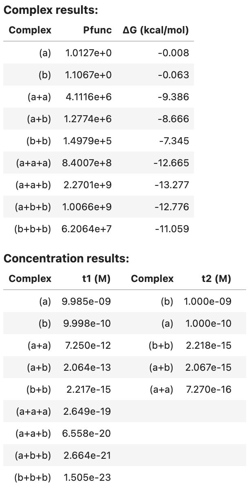
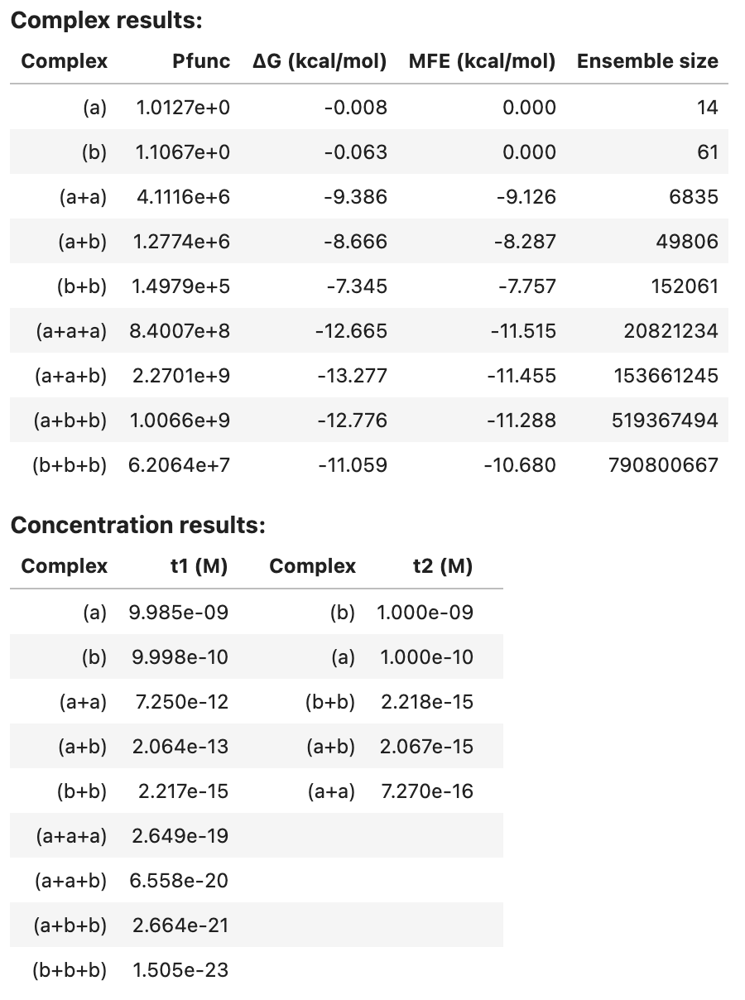
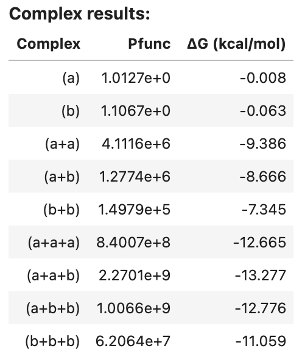
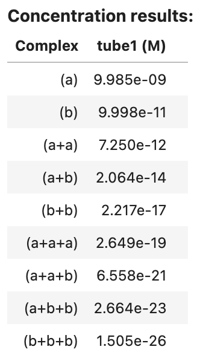
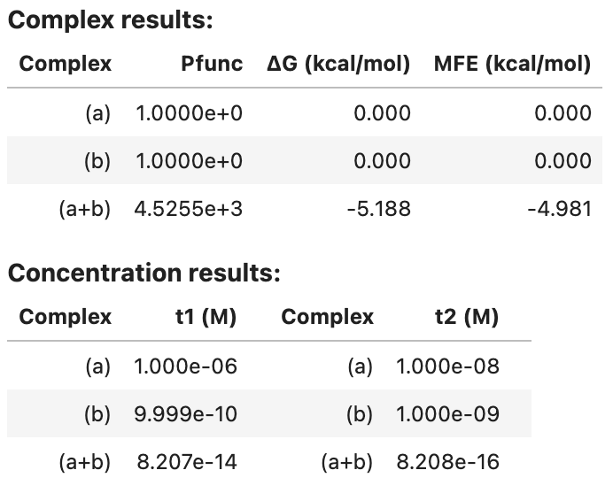
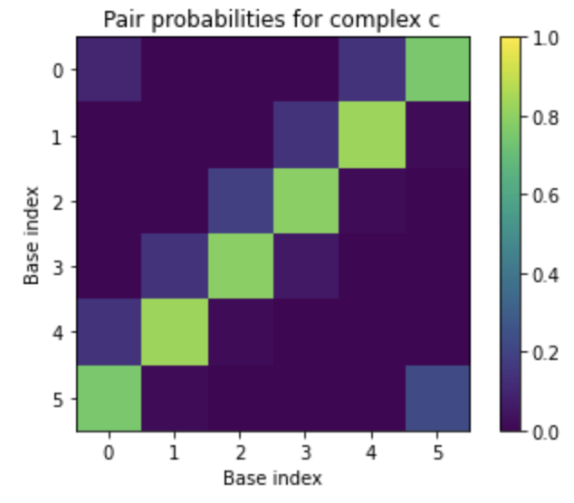

# Analysis Jobs

NUPACK provides the capability to analyze equilibrium properties over one of two ensembles:

- **Complex Analysis:** analyze the equilibrium base-pairing properties of a complex of interacting nucleic acid strands [@Dirks07,@Fornace20].

- **Test Tube Analysis:** analyze the equilibrium concentrations and base-pairing properties for a test tube of interacting nucleic acid strands [@Dirks07,@Fornace20].

Note that a complex ensemble is subsidiary to a test tube ensemble, so complex analysis is inherent in test tube analysis (but not vice versa). As it is typically infeasible to experimentally study a single complex in isolation, we recommend analyzing nucleic acid strands in a test tube ensemble that contains the complex of interest as well as other competing complexes that might form in solution. For example, if one is experimentally studying strands A and B that are intended to predominantly form a secondary structure within the ensemble of complex A$\cdot$ B, one should not presuppose that the strands do indeed form A$\cdot$ B and simply analyze the base-pairing properties of that complex. Instead, it is more physically relevant to analyze a test tube ensemble containing strands A and B interacting to form multiple complex species (e.g., A, B, A$\cdot$A, A$\cdot$B, B$\cdot$B) so as to capture both concentration information (how much A$\cdot$B forms?) and structural information (what are the base-pairing properties of A$\cdot$B when it does form?).

NUPACK analysis algorithms enable simultaneous analysis of one or more test tube ensembles, providing significant cost savings if the same strands are present in more than one test tube. If for some reason, the test tube ensemble is not of interest for your application, NUPACK analysis algorithms also enable simultaneous analysis of one or more complex ensembles, providing significant cost savings if the same strands are present in more than one complex.

<hr>

## Specify a strand

A `Strand` is a single RNA or DNA molecule specified as a sequence and a strand name (keyword `name`):
```python
A = Strand('AGUCUAGGAUUCGGCGUGGGUUAA', name='A') # name is required for strands
B = Strand('UUAACCCACGCCGAAUCCUAGACUCAAAGUAGUCUAGGAUUCGGCGUG', name='B')
C = Strand('AGUCUAGGAUUCGGCGUGGGUUAACACGCCGAAUCCUAGACUACUUUG', name='C')
```

A `Strand` sequence must contain only `'ACGTU'`. Two strands are treated as indistinguishable only if they have the same name and the same sequence.

A `Strand` object supports a `nt()` method for calculating the number of nucleotides, for example:

```python
A.nt() # --> 24
```

---

## Specify a complex ensemble

A `Complex` of one or more interacting strands is specified as an ordered list of strands (i.e., an ordering of strands around a circle in a [polymer graph](definitions.md#secondary-structure)) and an optional complex name (keyword `name`):
```python
c1 = Complex([A]) # name is optional for complexes
c2 = Complex([A, B, B, C], name='ABBC')
c3 = Complex([A, A], name='AA')
```

!!! Note
    Commands that expect a `Complex` as an argument (e.g., `c2`) will alternatively accept a strand ordering (e.g.,`[A, B, B, C]`). Two complexes are considered to be the same if they represent the same strand ordering around a circle independent of rotations (e.g., `Complex([A,B,C]) == Complex([B,C,A]) == Complex([C,A,B])`).

In certain cases, it may be desirable to adjust the free energy of a complex (for example, if a protein is known to stabilize the complex). For such cases, the optional keyword `bonus` can be used to specify an additional free energy in kcal/mol (default: 0; negative value is stabilizing, postive value is destabilizing):

```python
# destabilize c4 by 1 kcal/mol
c4 = Complex([A, B, C], name='ABC', bonus=+1.0)

# stabilize c5 by 10 kcal/mol
c5 = Complex([A, B], name='AB', bonus=-10.0)
```

Additional fields and methods are available for a `Complex` object:

- `.strands`: a tuple of strands
- `.nstrands()`: the number of strands in the complex
- `.nt()`: the number of nucleotides in the complex


For example:

```python
c2.strands    # --> (<Strand A>, <Strand B>, <Strand B>, <Strand C>)
c2.nstrands() # --> 4
c2.nt()       # --> 168
```


## Specify a test tube ensemble

A `Tube` is specified as a tube name (keyword `name`) and a set of strands (keyword `strands`), each introduced at a user-specified concentration (units of `M`), that interact to form a set of complexes (keyword `complexes`: defaults to the strand set).
The set of complexes is optionally specified using `SetSpec()` in any of three ways:

- Combinatorially using keyword `max_size` to automatically generate the set of all complexes up to a specified number of strands (default: `max_size=1`).
- Using keyword `include` to include an explicitly specified set of complexes (default: `None`).
- Using keyword `exclude` to exclude an explicitly specified set of complexes (default: `None`).

For example:

```python
t1 = Tube(strands={A: 1e-6, B: 1e-8}, name='t1') # complexes defaults to [A, B]

t2 = Tube(strands={A: 1e-6, B: 1e-8, C: 1e-12},
    complexes=SetSpec(max_size=3, include=[c2,[B, B, B, B]], exclude=[c1]),
    name='t2')

```

If desired, the complexes in a specified `Tube` can be queried as follows:

```python
print(t1.complexes) # --> {<Complex A>, <Complex B>}
print(t2.complexes) # --> {<Complex (C+C+B)>, <Complex (B)>,
    # <Complex (A+C+B)>, <Complex (C+C+C)>, <Complex (C)>, <Complex (A+A+B)>,
    # <Complex (A+C)>, <Complex (B+B+B+B)>, <Complex (A+A)>, <Complex (A+B+B)>,
    # <Complex (B+B)>, <Complex (A+B)>, <Complex (B+B+B)>, <Complex (A+B+C)>,
    # <Complex (A+C+C)>, <Complex (A+A+A)>, <Complex (C+C)>, <Complex (A+A+C)>,
    # <Complex ABBC>, <Complex (C+B+B)>, <Complex (C+B)>}
```

!!! Note
    Note that `include` and `exclude` accept both complex identifiers (e.g., `c2`) and strand orderings (e.g., `[B, B, B, B]`).

---

## Run a test tube analysis job

The `tube_analysis` command calculates the [partition function](definitions.md#partition-function), and [equilibrium concentration](definitions.md#equilibrium-complex-concentrations), for each complex species $j$ in one or more test tube ensembles. The test tube ensembles to be analyzed are specified using the `tubes` keyword. If desired, a [physical model](model.md#model-specification) is specified using the `model` keyword (otherwise the default physical model is used):

```python
# specify strands
a = Strand('CUGAUCGAU', name='a')
b = Strand('GAUCGUAGUC', name='b')

# specify tubes
t1 = Tube(strands={a: 1e-8, b: 1e-9}, complexes=SetSpec(max_size=3), name='t1')
t2 = Tube(strands={a: 1e-10, b: 1e-9}, complexes=SetSpec(max_size=2), name='t2')

# analyze tubes
model1 = Model()
tube_results = tube_analysis(tubes=[t1, t2], model=model1)
```

`tube_analysis` returns an `AnalysisResult` object that can be viewed as a table in a Jupyter notebook, for example:

```python
tube_results
```
Output:
> 

For each complex in the ensemble, the [partition function](definitions.md#partition-function) and [complex free energy](definitions.md#complex-free-energy) (units of kcal/mol) are displayed. For each tube, the [equilibrium complex concentration](definitions.md#equilibrium-complex-concentration) of each complex in the tube is displayed (units of M).

---

Optionally, additional quantities are calculated for each complex in the specified tubes (see [Job Options](analysis.md#job-options)). For example, additionally calculate [equilibrium base-pairing probabilities](definitions.md#equilibrium-base-pairing-probabilities), the [MFE proxy structure(s)](definitions.md#mfe-proxy-structure), 100 [Boltzmann-sampled structures](definitions.md#boltzmann-sampled-structures), and the [ensemble size](definitions.md#complex-ensemble-size) for each complex in the tube:

```python
model1 = Model()
tube_results2 = tube_analysis(tubes=[t1, t2], model=model1,
    compute=['pairs', 'mfe', 'sample', 'ensemble_size'],
    options={'num_sample': 100}) # max_size=1 default
```
To display a summary table of results in a Jupyter notebook:

```python
tube_results2
```
Output:

> 

Note that `pairs` and `sample` results are too large to be included in the summary table. See below for [programmatic access](#programmatic-access) to these results.

---

!!! Note
    If desired, the results of a `tube_analysis` job can alternatively be calculated in two steps:

    - Step 1: run a `complex_analysis` job (to calculate the [partition function](definitions.md#partition-function) for each complex);
    - Step 2: run a `complex_concentrations` job (to calculate the [equilibrium concentration](definitions.md#equilibrium-complex-concentrations) for each complex in the context of a test tube given user-specified strand concentrations).

    Most of the computational cost is in Step 1. The user-specified strand concentrations are used only in Step 2. Hence, if you intend to analyze N test tubes containing the same strand species but N different sets of strand concentrations, it is cheaper to call `complex_analysis` once and `complex_concentrations` N times, rather than to call `tube_analysis` N times.

## Specify a set of complexes

A `ComplexSet` is specified as a set of strands (keyword `strands`) that interact to form a set of complexes (keyword `complexes`: defaults to the strand set). The set of complexes is optionally specified using `SetSpec()` in any of three ways:

- Combinatorially using keyword `max_size` to automatically generate the set of all complexes up to a specified number of strands (default: `max_size=1`).
- Using keyword `include` to include an explicitly specified set of complexes (default: `None`).
- Using keyword `exclude` to exclude an explicitly specified set of complexes (default: `None`).

For example:

```python
set1 = ComplexSet(strands=[A, B, C]) # complexes defaults to [[A], [B], [C]]

set2 = ComplexSet(strands=[A, B, C],
    complexes=SetSpec(max_size=3, include=[c2, [B, B, B, B]], exclude=[c1]))
```

!!! Note
    Note that a `ComplexSet` and a `Tube` both specify a set of complexes $\Psi$ that form from a set of strands $\Psi^0$. The difference is that `Tube` further specifies the concentration of each strand in $\Psi^0$ in order to specify a [test tube ensemble](definitions.md#test-tube-ensemble).


---

## Run a complex analysis job

The `complex_analysis` command calculates one or more physical quantities (see [Job Options](analysis.md#job-options))
for each complex in a `ComplexSet`:

```python
# specify strands
a = Strand('CUGAUCGAU', name='a')
b = Strand('GAUCGUAGUC', name='b')

# specify complex set
set1 = ComplexSet(strands=[a, b], complexes=SetSpec(max_size=3))

# calculate the partition function for each complex in the complex set
model1 = Model()
complex_results1 = complex_analysis(complexes=set1, model=model1, compute=['pfunc'])
```

---

`complex_analysis` returns an `AnalysisResult` object that can be viewed as a table in a Jupyter notebook, for example:

```python
complex_results1
```

Output:

> 


If desired, a `Tube` can be specified in place of a `ComplexSet`, in which case the strand concentrations are ignored since `complex_analysis` does not calculate equilibrium complex concentrations, and hence does not require concentration information for the strand species. For example:

```python
# specify strands
a = Strand('CUGAUCGAU', name='a')
b = Strand('GAUCGUAGUC', name='b')

# specify tube
tube1 = Tube(strands={a:1e-8, b:1e-10}, complexes=SetSpec(max_size=3), name='tube1')

# calculate the partition function for each complex in the tube
model1 = Model()
complex_results2 = complex_analysis(complexes=tube1, model=model1, compute=['pfunc'])
```

---

## Run a complex concentrations job

Use the `complex_concentrations` command to calculate the [equilibrium concentration](definitions.md#equilibrium-complex-concentrations) of each complex in a test tube ensemble (keyword `tube`) using the `AnalysisResult` data (keyword `data`) from a previous call to `complex_analysis` (which at minimum must contain the partition function for each complex). The tube ensemble can be specified either using `Tube` (which specifies strand concentrations) or as a `ComplexSet`, in which case the strand concentrations must additionally be specified (keyword `concentrations`):

```python
 # specify strand concentrations for ComplexSet set1
concentration_results1 = complex_concentrations(tube=set1, data=complex_results1,
    concentrations={a: 1e-8, b: 1e-8})

# use strand concentrations previously specified for tube1
concentration_results2 = complex_concentrations(tube=tube1, data=complex_results2)
```

!!! Note
    Note that `complex_concentrations` operates on a single tube ensemble at a time since each tube represents a separate coupled equilibrium problem and no savings can be achieved by considering multiple concentration solves at the same time.

---

`complex_concentrations` returns an `AnalysisResult` object that can be viewed as a table in a Jupyter notebook, for example:

```python
concentration_results2
```

Output:

> 

---

## Job options

The `compute` keyword is optional for `tube_analysis` (default: `'pfunc'`) and required for `complex_analysis` (no default), specifying a list of strings denoting calculations to be performed for each complex [@Fornace20]:

- `'pfunc'`: calculate the [partition function](definitions.md#partition-function).

- `'pairs'`: calculate the matrix of [equilibrium base-pairing probabilities](definitions.md#equilibrium-base-pairing-probabilities). If `'pairs'` is specified, `tube_analysis` or `complex_concentrations` will further calculate the matrix of [test tube ensemble pair fractions](definitions.md#ensemble-pair-fractions). See the `sparsity_fraction` and `sparsity_threshold` options below.

- `'sample'`: calculate a set of [Boltzmann-sampled structures](definitions.md#boltzmann-sampled-structures) from the complex ensemble. See option `num_sample` below.

- `'mfe'`: calculate the [MFE proxy structure](definitions.md#mfe-proxy-structure), the free energy of the MFE proxy secondary structure and the free energy of the MFE stacking state. If there is more than one MFE stacking state, the algorithm returns a list of the corresponding MFE proxy secondary structures, each with the free energy of the MFE proxy secondary structure and with the (same) free energy of the MFE stacking state.

- `'subopt'`: calculate the set of [suboptimal proxy structures](definitions.md#suboptimal-proxy-structures) with a stacking state within a specified free energy gap of the MFE stacking state. The algorithm returns a list of suboptimal proxy secondary strutures, each with the free energy of the MFE proxy secondary structure, and with the free energy of its lowest-energy stacking state that falls within the energy gap. See option `subopt_gap` below.


- `'ensemble_size'`: calculate the [complex ensemble size](definitions.md#complex-ensemble-size) in terms of either the number of secondary structures (if using a [physical model](model.md#model-specification) with `nostacking`) or the number of stacking states (if using a [physical model](model.md#model-specification) with `stacking`).

The optional `options` keyword specifies options that modify the calculations performed for each complex:

- `'sparsity_fraction': f` can be used in conjuction with `'pairs'` to return a sparse matrix containing the fraction `f` of the largest pair probabilities for each base (default `'sparsity': 1` returns the full pair probability matrix).

- `'sparsity_threshold': t` can be used in conjuction with `'pairs'` to return a sparse matrix containing the only pair probabilities greater than or equal to `t` (default `'sparsity_threshold': 0` returns the full pair probability matrix).

- `'num_sample': n` can be used in conjunction with `'sample'` to specify the number of structures to be sampled (default `'num_sample': 1`).

- `'subopt_gap': g` can be used in conjunction with `'subopt'` to specify the (non-negative) free energy gap in kcal/mol (default `'subopt_gap': 0`).


---

## Job results

Scalar results of NUPACK analysis jobs can be conveniently displayed as a table, printed as text, or introspected programmatically. Consider the following test tube analysis job:

```python
a = Strand('CCC', name='a')
b = Strand('GGG', name='b')
c = Complex([a, b], name='c')

t1 = Tube({a: 1e-6, b: 1e-9}, complexes=SetSpec(max_size=2, include=[c]), name='t1')
t2 = Tube({a: 1e-8, b: 1e-9}, complexes=SetSpec(include=[c]), name='t2')

my_model = Model()
my_result = tube_analysis([t1, t2], model=my_model,
    compute=['pfunc', 'pairs', 'mfe', 'sample', 'subopt'],
    options={'num_sample': 2, 'energy_gap': 0.5})
```

### Tabular display
You can display a summary table of results in a Jupyter notebook, for example:

```python
my_result
```

Output:

> 

### Textual display

You can view an ASCII representation of the same data by using the `print` function:

```python
print(my_result)
```

Output:

> ```
> Complex results:
>   Complex      Pfunc dG (kcal/mol) MFE (kcal/mol)
> 0     (a)  1.0000e+0         0.000          0.000
> 1     (b)  1.0000e+0         0.000          0.000
> 2   (a+b)  4.5255e+3        -5.188         -4.981
> Concentration results:
> Complex    t1 (M)   Complex    t2 (M)
>     (a) 1.000e-06       (a) 1.000e-08
>     (b) 9.999e-10       (b) 1.000e-09
>   (a+b) 8.207e-14     (a+b) 8.208e-16
> ```

For convenience, you can print the identical ASCII result to a text file using the `save_text` function:

```python
my_result.save_text('my_result.txt')
```


### Programmatic access

More detailed results can also be displayed by programmatic access into an `AnalysisResult` object. This class contains two fields:

- `.complexes`: a Python `dict` mapping each `Complex` to a `ComplexResult`
- `.tubes`: a Python `dict` mapping each `Tube` to a `TubeResult`

The information contained in these two fields depends on which type of analysis calculation was performed:

- For [`tube_analysis`](#run-a-tube-analysis-job), the `.tubes` and `.complexes` fields are both non-empty.
- For [`complex_analysis`](#run-a-complex-analysis-job), only the `.complexes` field is non-empty.
- For [`complex_concentrations`](#run-a-complex-concentration-job), only the `.tubes` field is non-empty.

For convenience, you can index into an `AnalysisResult` via a `Complex` or `Tube` identifier (or via the assigned or auto-generated name of a `Complex` or `Tube`) as described in the following two sections.


### Results for individual complexes

You can index into `AnalysisResult` object via a `Complex` identifier (or via the name of a `Complex`) to get a `ComplexResult` object containing all the complex ensemble quantities that were calculated in a `tube_analysis` or `complex_analysis` calculation. A `ComplexResult` contains the following fields (if a quantity was not computed, the field is set to `None`):

- `pfunc`: the complex [partition function](definitions.md#partition-function) (held as a `decimal.Decimal`; convert to a `float` via `float(pf)` or calculate the logarithm via `float(pf.log())`).
- `free_energy`: the [complex free energy](definitions.md#complex-free-energy) in kcal/mol (held as a `float`).
- `pairs`: the matrix of [equilibrium base-pairing probabilities](definitions.md#equilibrium-base-pairing-probabilities) (held as a `PairsMatrix` object containing a `.to_array()` method for conversion to numpy as illustrated below).
- `sample`: a list of [Boltzmann-sampled structures](definitions.md#boltzmann-sampled-structures), each an instance of a `Structure` object.
- `mfe`: a list of [MFE proxy structures](definitions.md#mfe-proxy-structure). Each entry contains fields `.structure`, `.energy`, and `.stack_energy`. `.energy` is the free energy of the MFE proxy secondary structure, while `.stack_energy` is the free energy of the MFE stacking state.
- `subopt`: a list of [suboptimal proxy structures](definitions.md#suboptimal-proxy-structures). Each entry contains fields `.structure`, `.energy`, and `.stack_energy`. `.energy` is the free energy of the MFE proxy secondary structure, while `.stack_energy` is the free energy of its lowest-energy stacking state that falls within the energy gap.
- `ensemble_size`: the [complex ensemble size](definitions.md#complex-ensemble-size) (held as `int`) representing either the number of secondary structures (if using a [physical model](model.md#model-specification) with `nostacking`) or the number of stacking states (if using a [physical model](model.md#model-specification) with `stacking`).
- `model`: the `Model` that was used for the analysis calculation.

<!-- - `mfe`: the [free energy of the MFE proxy structure(s)](definitions.md#mfe-proxy-structure) (held as `float`) -->
<!-- - `mfe_stack`: the [free energy of the MFE stacking state](definitions.md#mfe-proxy-structure) (held as `float`) -->

---

For example, we can index the `AnalysisResult` object `my_result` with complex `c` (or by its name `'c'`) to obtain a `ComplexResult` object `c_result` that enables printing of specific physical quantities for that complex:

```python
c_result = my_result[c] # equivalent to my_result['c']
print('Physical quantities for complex c')
print('Complex free energy: %.2f kcal/mol' % c_result.free_energy)
print('Partition function: %.2e' % c_result.pfunc)
print('MFE proxy structure: %s' % c_result.mfe[0].structure)
print('Free energy of MFE proxy structure: %.2f kcal/mol' % c_result.mfe[0].energy)
print('Equilibrium pair probabilities: \n%s' % c_result.pairs)
```

Output:

```
Physical quantities for complex c
Complex free energy: -5.19 kcal/mol
Partition function: 4.53e+03
MFE proxy structure: (((+)))
Free energy of MFE proxy structure: -4.98 kcal/mol
Equilibrium pair probabilities:
[[0.1002 0.0000 0.0000 0.0007 0.1474 0.7518]
 [0.0000 0.0037 0.0000 0.1474 0.8307 0.0182]
 [0.0000 0.0000 0.1904 0.7910 0.0185 0.0001]
 [0.0007 0.1474 0.7910 0.0609 0.0000 0.0000]
 [0.1474 0.8307 0.0185 0.0000 0.0035 0.0000]
 [0.7518 0.0182 0.0001 0.0000 0.0000 0.2299]]
```

!!! Note
    Note that a complex such as `(a+a)` that was auto-generated as part of the test tube ensemble (using `max_size=2`) does not have an identifier, but does have an auto-generated name that can be used to index an `AnalysisResult`:

    ```python
    aa_result = my_result['(a+a)']
    ```


If desired, the MFE proxy structure can be represented as a [structure matrix](definitions.md#secondary-structure) of zeros and ones:

```python
c_result = my_result[c]
print('MFE proxy structure:\n%s' % c_result.mfe[0].structure.matrix())
```

Output

```
MFE proxy structure:
[[0 0 0 0 0 1]
 [0 0 0 0 1 0]
 [0 0 0 1 0 0]
 [0 0 1 0 0 0]
 [0 1 0 0 0 0]
 [1 0 0 0 0 0]]
```

The equilibrium pair probability matrix is returned as a `PairsMatrix` object, which can be converted to a `numpy` array via the `to_array()` method for display in a Jupyter notebook:

```python
import matplotlib.pyplot as plt

plt.imshow(my_result[c].pairs.to_array())
plt.xlabel('Base index')
plt.ylabel('Base index')
plt.title('Pair probabilities for complex c')
plt.colorbar()
plt.clim(0, 1)
plt.savefig('my-figure.pdf') # optionally, save a PDF of your figure
```

Output:

> 

For some use cases, you may wish to convert a `PairsMatrix` to a `scipy` matrix via the `to_sparse()` method.


!!! Note
    Note that some users may need to include `%matplotlib inline` at the top of the Jupyter notebook for the pairs plot to appear.

---

It is straightforward to collect information across complexes in an `AnalysisResult` object. Since `my_result.complexes` is an ordinary python `dict`, iterating through its `.items()` enables collection of each complex result. For example, to operate on the equilibrium pair probability matrix for each complex in `my_result`:

```python
import numpy as np

for my_complex, complex_result in my_result.complexes.items():
    P = complex_result.pairs.to_array()
    s = 'Expected number of unpaired nucleotides at equilibrium in complex %s = %.2f'
    print(s % (my_complex.name, np.diagonal(P).sum()))
```

Output:

```
Expected number of unpaired nucleotides at equilibrium in complex (a+b) = 0.59
Expected number of unpaired nucleotides at equilibrium in complex (a) = 3.00
Expected number of unpaired nucleotides at equilibrium in complex (b) = 3.00
```

To collect a `dict` of MFEs for each complex:

```python
my_mfes = {my_complex.name: complex_result.mfe[0].energy
    for my_complex, complex_result in my_result.complexes.items()}
print(my_mfes)
```

Output:

```
{'(a+b)': -4.981351375579834, '(a)': 0.0, '(b)': 0.0}
```

To print out the complex concentrations for a given tube:

```python
for my_complex, conc in my_result.tubes[t1].complex_concentrations.items():
    print('The equilibrium concentration of %s is %.2e M' % (my_complex.name, conc))
```

Output:

```
The equilibrium concentration of (a+b) is 8.21e-14 M
The equilibrium concentration of (a) is 1.00e-06 M
The equilibrium concentration of (b) is 1.00e-09 M
```

---


### Results for individual test tubes

You can index into an `AnalysisResult` object via a `Tube` identifier (or via the name of a `Tube`) to get a `TubeResult` object containing all the tube ensemble quantities that were calculated in a `tube_analysis` or `complex_concentrations` calculation. This class contains the following fields:

- `complex_concentrations`: a `dict` from `Complex` to its [equilibrium concentration](definitions.md#equilibrium-complex-concentrations) in molar (held as a `float`).
- `ensemble_pair_fractions`: a square matrix of [test tube ensemble pair fractions](definitions.md#test-tube-ensemble-pair-fractions). Row and column indices refer to the concatenated base index formed by concatenating the strands of the input `Tube` (in order). This field is `None` if  pair probabilities were not calculated (i.e., if option `pairs` was not specified for the `tube_analysis` or `complex_analysis` job).

Concentrations may be printed as follows:

```python
t1_result = my_result[t1] # equivalent to my_result['t1']
for my_complex, conc in t1_result.complex_concentrations.items():
    print('The equilibrium concentration of %s is %.3e M' % (my_complex.name, conc))
```

Output:

```
The equilibrium concentration of (a+b) is 8.207e-14 M
The equilibrium concentration of (a) is 1.000e-06 M
The equilibrium concentration of (b) is 9.999e-10 M
```

Test tube ensemble pair fractions may be printed as follows:

```python
print(t1_result.ensemble_pair_fractions)
```

Output:

```
[[1.0000 0.0000 0.0000 0.0000 0.0000 0.0000]
 [0.0000 1.0000 0.0000 0.0000 0.0000 0.0000]
 [0.0000 0.0000 1.0000 0.0000 0.0000 0.0000]
 [0.0000 0.0000 0.0001 0.9999 0.0000 0.0000]
 [0.0000 0.0001 0.0000 0.0000 0.9999 0.0000]
 [0.0001 0.0000 0.0000 0.0000 0.0000 0.9999]]
```

### Saving a job summary

To save a textual job summary using the `save_text` method:

```python
my_result.save_text('my-result.txt')
```

### Saving and reloading job results

Save an `AnalysisResult` as a binary file using the `save` method:

```python
my_result.save('my-result.o')
```

to enable reloading during a future session using the `load` method:

```python
my_result = AnalysisResult.load('my-result.o')
```

This functionality uses Python's built-in `pickle` module.
