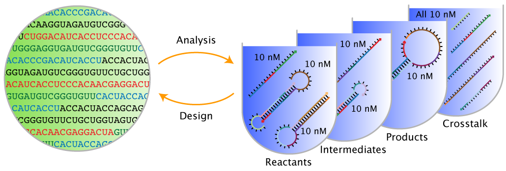

# Overview

## About
NUPACK is a growing software suite for the analysis and design of nucleic acid structures, devices, and systems serving the needs of researchers in the fields of nucleic acid nanotechnology, molecular programming, synthetic biology, and across the life sciences more broadly. Much of this software can be conveniently run using the NUPACK web application at [nupack.org](http://www.nupack.org) [@Zadeh11a]. This User Guide provides documentation for the NUPACK Source Code.

When finishing a project that has benefited from NUPACK calculations, please remember to [cite](index.md#citation) the NUPACK web application and algorithms appropriately; citations are an important component in helping to secure funding for NUPACK development and maintenance. Please email us with questions, comments, feature requests, and bug reports at <support@nupack.org>.

— The NUPACK Team

<hr>


## Problem Categories
NUPACK algorithms address two fundamental classes of problems:

- **Sequence analysis:** given a set of DNA or RNA strands, analyze the equilibrium base-pairing properties over a specified ensemble.
- **Sequence design:** given a set of desired equilibrium base-pairing properties, design the sequences of a set of DNA or RNA strands over a specified ensemble. Sequence design is performed subject to diverse user-specified sequence constraints including composition constraints, complementarity constraints, pattern prevention constraints, and biological constraints.

<p align="center">

</p>

<p style="text-align:center;"><b>Figure</b>: Sequence analysis and design using NUPACK.</p>

NUPACK algorithms operate over two fundamental ensembles:

- **Complex ensemble:** the ensemble of all (unpseudoknotted connected) secondary structures for an arbitrary number of interacting RNA or DNA strands.
- **Test tube ensemble:** the ensemble of a dilute solution containing an arbitrary number of RNA or DNA strand species (introduced at user-specified concentrations) interacting to form an arbitrary number of complex species.

Furthermore, to enable reaction pathway engineering of dynamic hybridization cascades or large-scale structural engineering including pseudoknots, NUPACK generalizes sequence analysis and design to multi-complex and multi-tube ensembles [@Wolfe17].

NUPACK capabilities are presented in three categories:

- **Analysis:** Analyze the equilibrium base-pairing properties one or more test tube ensembles (or one or more complex ensembles). These are the all-purpose sequence analysis tools.
- **Design:** Design the the sequences for one or more test tube ensembles (or one or more complex ensembles). These are the all-purpose sequence design tools.
- **Utilities:** Analyze or design a single complex ensemble. These are quick tools applicable when your ensemble is a single complex.


!!! Examples

	Load Python NUPACK module

	```python
	from nupack import *
	```

	[Specify a physical model](model.md)
	```python
	model1 = Model(material='rna', celsius=37)
	```

	[Analyze a test tube](analysis.md)

	```python
	# specify strands
	A = Strand('CTGATCGAT', name='Strand A')
	B = Strand('GATCGTAGTC', name='Strand B')

	# specify tube
	t1 = Tube(strands={A: 1e-8, B: 1e-9},
		complexes=SetSpec(max_size=2), name='Tube 1') # all complexes of up to 2 strands

	# run tube analysis job
	my_results = tube_analysis(tubes=[t1], model=model1)
	```

	[Design a test tube](design.md)

	```python
	a = Domain('A4', name='Domain a')
	b = Domain('N10', name='Domain b') # equivalent sequence specification
	c = Domain('R5N5', name='Domain c')

	# specify target strands
	A = TargetStrand([a, a, b], name='Strand A')
	B = TargetStrand([~b, ~c], name='Strand B')  # ~e denotes the reverse complement of e
	C = TargetStrand([c], name='Strand C')

	# specify target complexes
	C1 = TargetComplex([A, B, C], '.8(10+)10(10+)10', name='Complex C1')
	C2 = TargetComplex([B, C], '.10(10+)10', name='Complex C2')

	# specify target tube
	tt1 = TargetTube(on_targets={C1: 1e-8, C2: 1e-8},
		off_targets=SetSpec(max_size=3),  # all off-target complexes of up to 3 strands
		name='TargetTube 1')

	# specify tube design problem
	my_des = tube_design(tubes=[tt1],
		hard_constraints=[], soft_constraints=[],
		defect_weights=None, options=None, model=model1)

	# run tube design job
	des_results = my_des.run(trials=3) # run 3 independent design trials
	```

## License

**NUPACK Software License Agreement for Non-Commercial Academic Use and Redistribution**    
Copyright &copy; 2020. California Institute of Technology. All rights reserved.

Use and redistribution in source form and/or binary form, with or without modification, are permitted for non-commercial academic purposes only, provided that the following conditions are met:

1. Redistributions in source form must retain the above copyright notice, this list of conditions and the following disclaimer.
2. Redistributions in binary form must reproduce the above copyright notice, this list of conditions and the following disclaimer in the documentation provided with the distribution.
3. Web applications that use the software in source form or binary form must reproduce the above copyright notice, this list of conditions and the following disclaimer in online documentation provided with the web application.
4. Neither the name of the copyright holder nor the names of its contributors may be used to endorse or promote derivative works without specific prior written permission.

**Disclaimer**    
*This software is provided by the copyright holders and contributors "as is" and any express or implied warranties, including, but not limited to, the implied warranties of merchantability and fitness for a particular purpose are disclaimed. In no event shall the copyright holder or contributors be liable for any direct, indirect, incidental, special, exemplary, or consequential damages (including, but not limited to, procurement of substitute goods or services; loss of use, data, or profits; or business interruption) however caused and on any theory of liability, whether in contract, strict liability, or tort (including negligence or otherwise) arising in any way out of the use of this software, even if advised of the possibility of such damage.*


<hr>


## Citation

For citation, please select from the list below as appropriate for your application:


**NUPACK Web Application**

- Run jobs online at [nupack.org](http://www.nupack.org)
	- J. N. Zadeh, C. D. Steenberg, J. S. Bois, B. R. Wolfe, M. B. Pierce, A. R. Khan, R. M. Dirks, N. A. Pierce. NUPACK: analysis and design of nucleic acid systems. [*J Comput Chem*](http://onlinelibrary.wiley.com/doi/10.1002/jcc.21596/abstract), 32:170–173, 2011. ([pdf](http://www.nupack.org/downloads/serve_public_file/jcc11a.pdf?type=pdf))

**NUPACK Analysis Algorithms**

- Complex analysis and test tube analysis
	- M.E. Fornace, N.J. Porubsky, and N.A. Pierce (2020). A unified dynamic programming framework for the analysis of interacting nucleic acid strands: enhanced models, scalability, and speed. [*ACS Synth Biol*](https://pubs.acs.org/doi/abs/10.1021/acssynbio.9b00523), 9:2665-2678, 2020. ([pdf](http://www.nupack.org/downloads/serve_public_file/fornace20.pdf?type=pdf), [supp info](http://www.nupack.org/downloads/serve_public_file/fornace20_supp.pdf?type=pdf))
	- R. M. Dirks, J. S. Bois, J. M. Schaeffer, E. Winfree, and N. A. Pierce. Thermodynamic analysis of interacting nucleic acid strands. [*SIAM Rev*](http://epubs.siam.org/doi/abs/10.1137/060651100), 49:65-88, 2007. ([pdf](http://www.nupack.org/downloads/serve_public_file/sirev07.pdf?type=pdf))

- Pseudoknot analysis
	- R. M. Dirks and N. A. Pierce. An algorithm for computing nucleic acid base-pairing probabilities including pseudoknots. [*J Comput Chem*](http://onlinelibrary.wiley.com/doi/10.1002/jcc.10296/abstract), 25:1295-1304, 2004. ([pdf](http://www.nupack.org/downloads/serve_public_file/jcc04.pdf?type=pdf))
	- R. M. Dirks and N. A. Pierce. A partition function algorithm for nucleic acid secondary structure including pseudoknots. [*J Comput Chem*](http://onlinelibrary.wiley.com/doi/10.1002/jcc.20057/abstract), 24:1664-1677, 2003. ([pdf](http://www.nupack.org/downloads/serve_public_file/jcc03.pdf?type=pdf), [supp info](http://www.nupack.org/downloads/serve_public_file/jcc03_supp.pdf?type=pdf))

**NUPACK Design Algorithms**

- Multi-tube design
	- B. R. Wolfe, N. J. Porubsky, J. N. Zadeh, R. M. Dirks, and N. A. Pierce. Constrained multistate sequence design for nucleic acid reaction pathway engineering. [*J Am Chem Soc*](http://pubs.acs.org/doi/abs/10.1021/jacs.6b12693), 139:3134-3144, 2017. ([pdf](http://www.nupack.org/downloads/serve_public_file/wolfe17.pdf?type=pdf), [supp info](http://www.nupack.org/downloads/serve_public_file/wolfe17_supp.pdf?type=pdf))

- Test tube design
	- B. R. Wolfe and N. A. Pierce. Sequence design for a test tube of interacting nucleic acid strands. [*ACS Synth Biol*](http://pubs.acs.org/doi/abs/10.1021/sb5002196), 4:1086-1100, 2015. ([pdf](http://www.nupack.org/downloads/serve_public_file/sb5002196.pdf?type=pdf), [supp info](http://www.nupack.org/downloads/serve_public_file/sb5002196_si_001.pdf?type=pdf), [supp tests](http://www.nupack.org/downloads/serve_public_file/sb5002196_si_002.zip?type=zip))

- Complex design
	- J. N. Zadeh, B. R. Wolfe, and N. A. Pierce. Nucleic acid sequence design via efficient ensemble defect optimization. [*J Comput Chem*](http://onlinelibrary.wiley.com/doi/10.1002/jcc.21633/abstract), 32:439–452, 2011. ([pdf](http://www.nupack.org/downloads/serve_public_file/jcc11b.pdf?type=pdf), [supp info](http://www.nupack.org/downloads/serve_public_file/JCC_21633_sm_suppinfo.pdf?type=pdf), [supp tests](http://www.nupack.org/downloads/serve_public_file/JCC_21633_sm_supptests.zip?type=zip))

- Design paradigms
	- R. M. Dirks, M. Lin, E. Winfree, and N. A. Pierce. Paradigms for computational nucleic acid design. [*Nucl Acids Res*](https://academic.oup.com/nar/article/32/4/1392/1038453), 32:1392-1403, 2004. ([pdf](http://www.nupack.org/downloads/serve_public_file/nar04.pdf?type=pdf), [supp info](http://www.nupack.org/downloads/serve_public_file/nar04_supp.pdf?type=pdf), [supp seqs](http://www.nupack.org/downloads/serve_public_file/nar04_sequences.tar.gz?type=zip))


## Acknowledgments
We thank all the NUPACK users that have helped out as beta testers over the years, as well as the many NUPACK users that have emailed <support@nupack.org> to request features or report bugs.
NUPACK is supported by the National Science Foundation (NSF-OAC-1835414) and by the Beckman Institute at Caltech (PMTC).
NUPACK has previously been supported by the National Science Foundation
(NSF-CCF-1317694, NSF-CCF-0832824, NSF-CHE-0533064, NSF-DMS-0506468, NSF-CAREER-0448835),
by the Gordon and Betty Moore Foundation (GBMF2809), by the John Simon Guggenheim Memorial Foundation,
by the National Institutes of Health (P50 HG004071), by the Ralph M. Parsons Foundation, and by the Charles Lee Powell Foundation.


## Versions

- **NUPACK 3.0**
    - Features:
	    - complex analysis [@Dirks07]
	    - complex design [@Zadeh11b]
	    - test tube analysis [@Dirks07]
	- Executables:
        - `pfunc`,`pairs`, `mfe`, `subopt`, `count`, `energy`, `prob`, `pairs`,
			`defect`, `complexes`, `concentrations`, `distributions`, `design`
        - These executables read input files containing comment lines preceded by `%`; blank lines are not permitted.
	- Terminology and notation:
        - details in [@Dirks07]
- **NUPACK 3.1**
    - New features:
	    - test tube design [@Wolfe15]
	- New executables:
	    - `tubedesign` and `tubedefect`
		- These executables read `*.np` script files written in v1 of the NUPACK scripting language
        <!-- (see ``Future Version: Script files'' below). -->
        - In `*.np` script files, a comment begins with `#` and continues for the rest of the line; blank lines are permitted.
    - Changes to existing executables:
	    - Name of executable `design` changed to `complexdesign`.
		- Name of executable `defect` changed to `complexdefect`.
		- Updates to the default options and
				output file formats for executables `complexes`,
				`concentrations`, and
				`distributions`. Use option `-v3.0` to revert to NUPACK 3.0 behavior using NUPACK 3.1.
    - Terminology and notation:
		- details in Section 1.1 of NUPACK 3.1 User Guide

- **NUPACK 3.2**
    - New features:
	    - constrained multistate test tube design [@Wolfe17]
    - New executables:
		- `multitubedesign` and  `multitubedefect`
		    - These executables read `*.np` script files written in v2 of the NUPACK scripting language.
			- In `*.np` script files, a comment begins with `#` and continues for the rest of the line; blank lines are permitted.
		- Terminology and notation:
	        - details in Section 1.1 of NUPACK 3.2 User Guide

- **NUPACK 4.0**
    - New features:
	    - unified dynamic programming framework [@Fornace20]
        - all-new code base
        - all-new NUPACK Python module
    - Commands:
    	- Scripting is done in Python
        - Indices start at 0 (previous versions indexed starting at 1)
	- Terminology and notation:
	    - details in [@Fornace20]
	- Revision notes:
        - 4.0.0.20: Release of first public beta
        - 4.0.0.21: Fix SSM display issue and wobble evaluation bug in design
        - 4.0.0.23: Fix incorrect rounding of ensemble_size result
        - 4.0.0.24: Fix diverging estimate of defects seen in design checkpoints
        - 4.0.0.25: Fix concentration failure resulting from division by 0
        - 4.0.0.26: Fix number of samples given for indistinguishable complexes
        - 4.0.0.27: Add native support for Mac arm64 (M1) architectures
        - 4.0.0.28: Add native support for Linux arch64 architecture, support Python 3.10, fix similarity soft constraint when specifying multiple domains
        - 4.0.1.0: Add `fraction_unpaired_bases` functionality, revise implementation of parallelism and cache usage, improve input validation
        - 4.0.1.1: Enable [parallelism](advanced.md#parallelism) by default, add the `threads` setting, and set design to only use up to `N` threads on a machine with `N` cores
        - 4.0.1.2: Remove support for Python 3.6, fix several bugs in 4.0.1 to do with parallel submission of designs, reloading designs, and other minor user interface problems
        - 4.0.1.3: Fix unbounded growth in memory cache, optimize parallelism in design further, minor interface improvements
        - 4.0.1.4: Fix concentration equilibration initial guess which occasionally caused lack of convergence
        - 4.0.1.5: Fix large memory usage in analysis jobs containing many complexes, improve cache constraint
        - 4.0.1.6: Fix missing `nt()` method in Domain class
