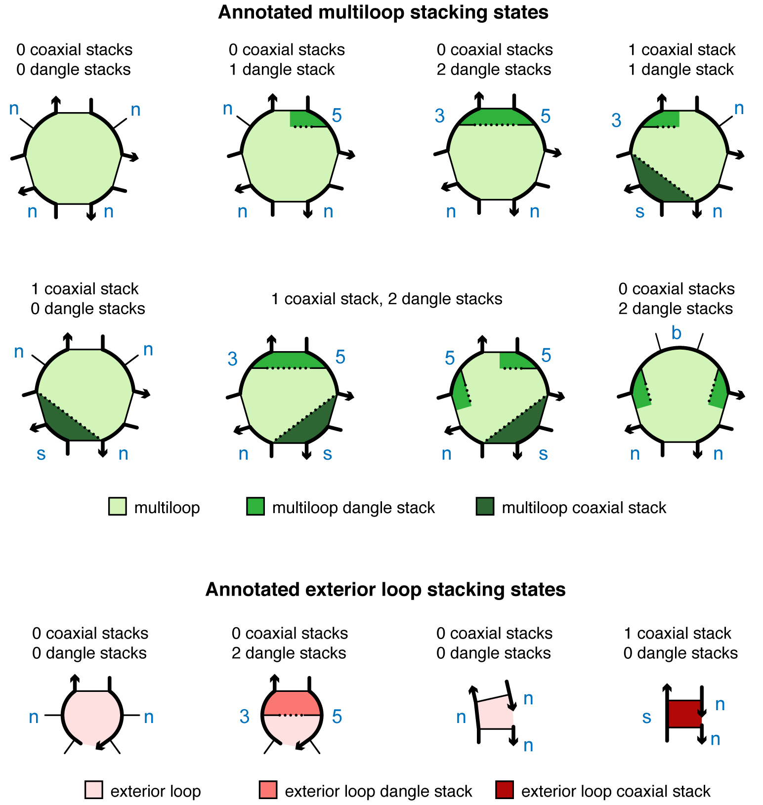

# Model Specification

<hr>


## Specify a physical model

NUPACK 4 analysis and design jobs are run based on a physical model created using the `Model` class:

```python
model1 = Model(material='rna', ensemble='stacking', celsius=37,
    sodium=1.0, magnesium=0.0)
```


Any unspecified properties take on their default values (which happen to be the ones specified for `model1` above).


<hr>


## Model options
The valid options for each property are described below.

### Material

NUPACK 4.1 algorithms use the following temperature-dependent free energy parameter sets for single-material jobs (RNA, DNA, or 2’OMe-RNA), mixed-material jobs (RNA/DNA or RNA/2’OMe-RNA), or custom-material jobs, specified by the keyword `material` (default: `material='rna'`):

- RNA single-material parameter sets: 
    - `rna` Shorthand for `rna06`.
    - `rna06` Based on [@Mathews99] and [@Lu06] with additional parameters [@Xia98,@Zuker03] including coaxial stacking [@Mathews99,@Turner10] and dangle stacking [@Serra95,@Zuker03,@Turner10] in a user specified concentration of Na$^+$.
    - `rna95` Based on [@Serra95] with additional parameters [@Zuker03] including coaxial stacking [@Mathews99,@Turner10] and dangle stacking [@Serra95,@Zuker03,@Turner10] in 1.0 M Na$^+$.
- DNA single-material parameter sets: 
    - `dna` Shorthand for `dna04.2`.
    - `dna04.2` Updated GT internal mismatch values [@Allawi97,@Allawi98a,@Allawi98b,@Allawi98c,@Peyret99,@SantaLucia04], internal asymmetry values [@SantaLucia04], and terminal mismatch values [@Turner10,@Mittal24]; in user-specified concentrations of Na$^+$, K$^+$, NH$^+_4$ and Mg$^{++}$ [@SantaLucia98,@Peyret00,@SantaLucia04].
    - `dna04.1` Based on [@SantaLucia98] and [@SantaLucia04] with additional parameters [@Zuker03] including coaxial stacking [@Peyret00] and dangle stacking [@Bommarito00,@Zuker03] in user-specified concentrations of Na$^+$, K$^+$, NH$^+_4$ and Mg$^{++}$ [@SantaLucia98,@Peyret00,@SantaLucia04].
- 2$'$OMe-RNA single-material parameter sets: 
    - `merna06` Based on [@Kierzek06] using stack loop, coaxial stacking, terminal base pair, and strand association values from `rna-merna06` and all other values from `rna06`; in 0.12 M  
        Na$^+$. 
- RNA/DNA mixed-material parameter sets:
    - `rna-dna06` Using hybrid stack loops [@Sugimoto95], hybrid internal mismatches [@Watkins11,@Sugimoto00], and chimeric stack loops [@Nakano04] with additional parameters for mixed-material loops [@Nanjundiah25] in a user-specified concentration of Na$^+$; for use in conjunction with single-material parameter sets `rna06` and `dna04`.
- RNA/2$'$OMe-RNA mixed-material parameter sets: 
    - `rna-merna06` Based on hybrid stack loops [@Kierzek06] with additional parameters for mixed-material loops [@Nanjundiah25]; for use in conjunction with single-material parameter sets `rna06` and `merna06` in 0.12 M Na$^+$.
- Custom parameter sets: 
    - `custom-parameters` Custom parameters provided in a JSON file (e.g., `custom-parameters.json`) using the same format as the provided parameter files. Provide $\Delta$G$_{37}$(loop) and $\Delta$H(loop) values to allow calculations at different temperatures or only $\Delta$G(loop) values to allow calculations at one temperature. Place the JSON file in the same directory as the default parameter files (specify `material = 'custom-parameters'`) or specify the full path to the file (`material = 'path/to/my/custom-parameters.json'`).

Free energies are expressed in kcal/mol. Base pairs are either [Watson-Crick pairs](definitions.md#watson-crick-pairs) or [wobble pairs](definitions.md#wobble-pairs).


<hr>


### Stacking

NUPACK 4 algorithms perform calculations on the following complex ensembles specified by the keyword `ensemble` (default: `ensemble='stacking'`):

- `stacking`
Complex ensemble with coaxial and dangle stacking (ensemble $\overline\Gamma^\shortparallel(\phi)$).

- `dangle-stacking`
Complex ensemble with dangle stacking.

- `coaxial-stacking`
Complex ensemble with coaxial stacking.

- `nostacking`
Complex ensemble without coaxial and dangle stacking (ensemble $\overline\Gamma(\phi)$).


<hr>

### Temperature

- `celsius`
Temperature is specified in $^\circ$C using the keyword `celsius` (default: `celsius=37`).
- `kelvin`
Alternatively, the temperature can be specified in K using the keyword `kelvin`.

<hr>

### Salts

NUPACK 4.1 algorithms support the following salt conditions: 

- For RNA single-material jobs using `rna06`:  
    - `sodium` Based on [@Nanjundiah25], the concentration of sodium ions, [Na$^+$], is specified in units of molar (default: 1.0, range: [0.05,1.0]) using the keyword `sodium`.
    - `magnesium` Only 0.0 M [Mg$^{++}$] is supported. 
- For RNA single-material jobs using `rna95`, the only supported salt conditions [@Mathews99, @Lu06] are 1.0 M [Na$^+$]. 
- For DNA single-material jobs using `dna04.1`/`dna04.2`:
    - `sodium` Based on [@SantaLucia98,@SantaLucia04], the sum of the concentrations of (monovalent) sodium, potassium, and ammonium ions, [Na$^+$]+[K$^+$]+[NH$^+_4$], is specified in units of molar (default: 1.0, range: [0.05,1.1]) using the keyword `sodium`.
    - `magnesium` Based on [@Peyret00,@Koehler05], the concentration of (divalent) magnesium ions, [Mg$^{++}$], is specified in units of molar (default: 0.0, range: [0.0,0.2]) using the keyword `magnesium`.
- For 2’OMe-RNA single-material jobs [@Kierzek06] using `merna06`, the only supported salt conditions are 0.12 M [Na$^+$]. 
- For RNA/DNA mixed-material jobs using `rna-dna06`:  
    - `sodium` Based on [@Nanjundiah25], the concentration of sodium ions, [Na$^+$], is specified in units of molar (default: 1.0, range: [0.12,1.0]) using the keyword `sodium`.
    - `magnesium` Only 0.0 M [Mg$^{++}$] is supported.
- For RNA/2’OMe-RNA mixed-material jobs [@Kierzek06] using `rna-merna06`, the only supported salt conditions are 0.12 M [Na$^+$]. 


<hr>

<!-- ### Wobble pairs

G$\cdot$U RNA wobble pairs are enabled by default in the provided RNA parameter sets.
G$\cdot$T DNA wobble pairs are disabled by default in the provided DNA parameter set.
However, wobble pairs may be manually enabled or disabled using the additional `wobble` parameter during model construction (e.g. `Model(..., wobble=True)`).
In the historical ensembles, a duplex terminated by a wobble pair is forbidden.


<hr>  -->


!!!example "Examples"
    - Define a model for DNA calculations at 23 $^\circ$C in $[{\rm Na}^{+}]= 0.5$ M and $[{\rm Mg}^{++}]= 0.01$ M:

    ```python
    model2 = Model(material='dna', celsius=23, sodium=0.5, magnesium=0.01)
    ```
    Note that `ensemble` is unspecified so it defaults to `ensemble='stacking'`.

    - Define a model using custom parameters at 45 $^\circ$C without coaxial and dangle stacking:

    ``` python
    model3 = Model(material='path/to/my/custom-parameters.json',
        ensemble='nostacking', celsius=45)
    ```


### Historical options


For backwards compatibility with NUPACK 3, the following historical complex ensembles without coaxial stacking and with approximate dangle stacking are supported:

- `none-nupack3`
No dangle stacking and no coaxial stacking (dangles `none` option for NUPACK 3)

- `some-nupack3`
Some dangle stacking and no coaxial stacking (dangles `some` option for NUPACK 3). A dangle energy is incorporated for each unpaired base flanking a duplex (a base flanking two duplexes contributes only the minimum of the two possible dangle energies).

- `all-nupack3`
All dangle stacking and no coaxial stacking (dangles `all` option for NUPACK 3). A dangle energy is incorporated for each unpaired base flanking a duplex (a base flanking two duplexes contributes both possible dangle energies).

For these historical ensembles, base pairs are either Watson-Crick pairs (`G`$\cdot$`C` and `A`$\cdot$`U` for RNA; `G`$\cdot$`C` and `A`$\cdot$`T` for DNA) or wobble pairs (`G`$\cdot$`U` for RNA; `G`$\cdot$`T` for DNA). Note that for the historical ensembles, `G`$\cdot$`T` is classified as a DNA wobble pair and not as a mismatch. The historical ensembles prohibit a wobble pair (`G`$\cdot$`U` or `G`$\cdot$`T`) as a terminal base pair in an exterior loop or a multiloop. As a result, an attempt to evaluate a free energy for a sequence $\phi$ and secondary structure $s$ that place a wobble pair as a terminal base pair in an exterior loop or multiloop will return $\overline{\Delta G}(\phi,s)=\Delta G(\phi,s) = \infty$. These historical ensembles can be used for calculations in combination with the following historical DNA and RNA parameter sets:

- `rna95-nupack3`
Same as `rna95` except that terminal mismatch free energies in exterior loops and multiloops are replaced by two dangle stacking free energies.

- `dna04-nupack3`
Same as `dna04` except that G$\cdot$T was treated as a wobble pair (analogous to a `G`$\cdot$`U` RNA wobble pair) instead of classifying `G` and `T` as a mismatch. Note that while terminal mismatch free energies in exterior loops and multiloops are replaced by two dangle stacking free energies, this is the same treatment as in `dna04`, as terminal mismatch parameters are not public for DNA [@SantaLucia04].

- `rna99-nupack3`
Parameters from [@Mathews99] with terminal mismatch free energies in exterior loops and multiloops replaced by two dangle stacking free energies. Parameters are provided only for 37 $^\circ$C.


## Compute loop free energy
The `loop_energy` method operates on a `Model` object to calculate the [loop free energy](definitions.md#loop-free-energies) in kcal/mol. The loop sequence is specified with keyword `loop` and the loop structure is specified with keyword `structure`. For example:

```python
my_model = Model(material='RNA', ensemble='stacking')

#Calculate the free energy of an unstructured strand
dGloop2 = my_model.loop_energy(loop='AAUU', structure='....')
print(dGloop2)
# --> 0.0

#Calculate the free energy of a hairpin loop
dGloop3 = my_model.loop_energy(loop='AACCCUU', structure='(.....)')
print(dGloop3)
# --> 5.15

#Calculate the free energy of an exterior loop
dGloop4 = my_model.loop_energy(loop='AA+UU', structure='((+))')
print(dGloop4)
# --> -0.9

#Calculate the free energy of a multiloop
dGloop5 = my_model.loop_energy(loop='AAU+ACU+AGU', structure='(.(+).(+).)')
print(dGloop5)
# --> 9.355
```

## Compute stacking state free energies

The `stack_energies` method operates on a `Model` object to calculate the [stacking state free energies](definitions.md#loop-free-energies) for the subensemble of stacking states in a single loop. The loop sequence is specified with keyword `loop` and the loop structure is specified with keyword `structure`. The algorithm returns a list of stacking states and the free energy for each in kcal/mol.

For a loop defined as a list of N snippets, a stacking state is specified as a string composed of one letter per snippet. For each snippet, the returned letter is:

- `'s'` if the snippet contains only 2 nucleotides, each base-paired to a nucleotide in the adjacent snippet, with the two base pairs coaxially stacked on each other
- `'b'` if  both the 5$'$ and 3$'$ unpaired nucleotides are dangle stacking on adjacent base pairs
- `'5'` if only the 5$'$-most unpaired base is dangle stacking on its adjacent base pair
- `'3'` if only the 3$'$-most unpaired base is dangle stacking its adjacent base pair
- `'n'` if none of the above apply (i.e., the snippet does not have a dangle at either the 5$'$ or 3$'$ end nor does it contain only 2 adjacent nucleotides participating in a coaxial stack)

For example, the following figures illustrate snippet annotations for coaxial and dangle stacking states in representative multiloops and exterior loops:

> 

For a specified multiloop or exterior loop sequence and structure, the `stack_energies` method returns a set of stacking state strings each with a corresponding stacking state free energy (kcal/mol):

```python
# Calculate the dangle stacking state free energies for an exterior loop
my_model.stack_energies(loop='CA+UC', structure='.(+).')
# --> {'35': -0.15, '3n': 0.15, 'n5': 0.35, 'nn': 0.45}

# Calculate the coaxial stacking state free energies for an exterior loop
my_model.stack_energies(loop='AA+U+U', structure='((+)+)')
# --> {'nnn': 0.9, 'snn': 0.0}

# Calculate the coxial stacking state free energies for a multiloop
my_model.stack_energies(loop='AU+AU+AU', structure='((+)(+))')
# --> {'nnn': 11.9725, 'nns': 10.8725, 'nsn': 10.8725, 'snn': 10.8725}
```

For loops that are not multiloops or exterior loops, the loop free energy is returned with a string indicating that there is no stacking state. For example, for a hairpin loop:

```python
my_model.stack_energies(loop='AAAAU', structure='(...)')
# --> {'n': 5.85}
```
