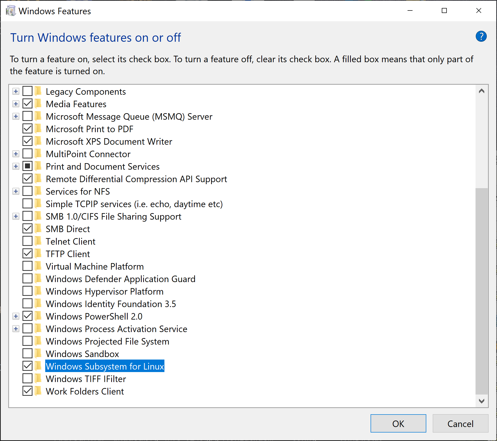
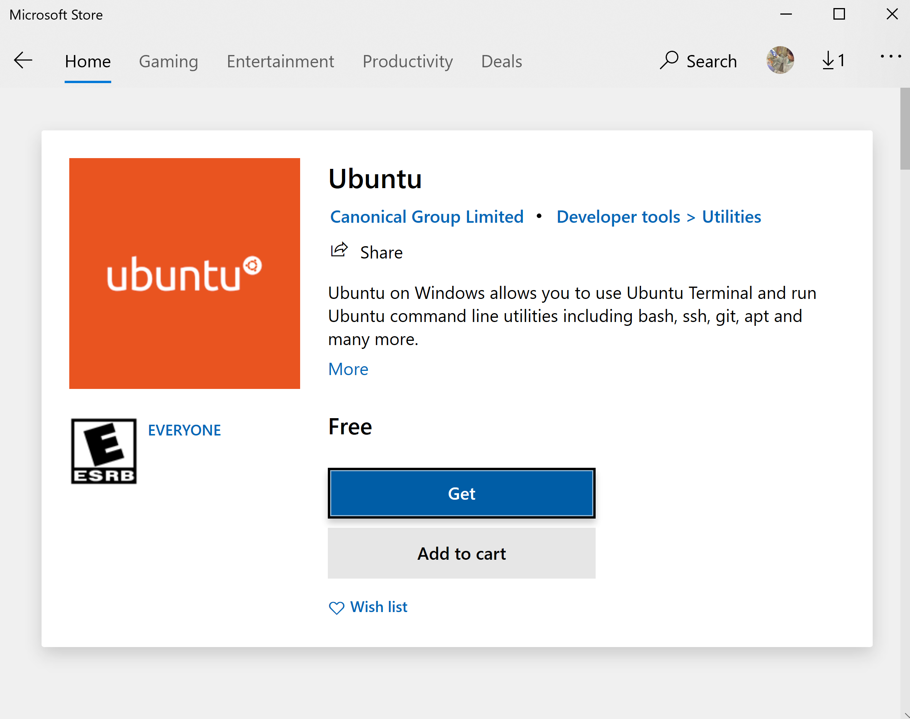
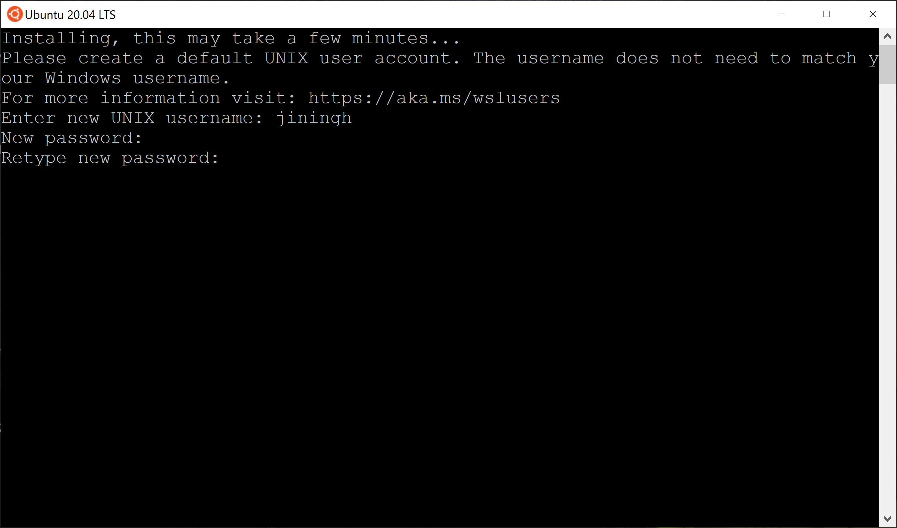
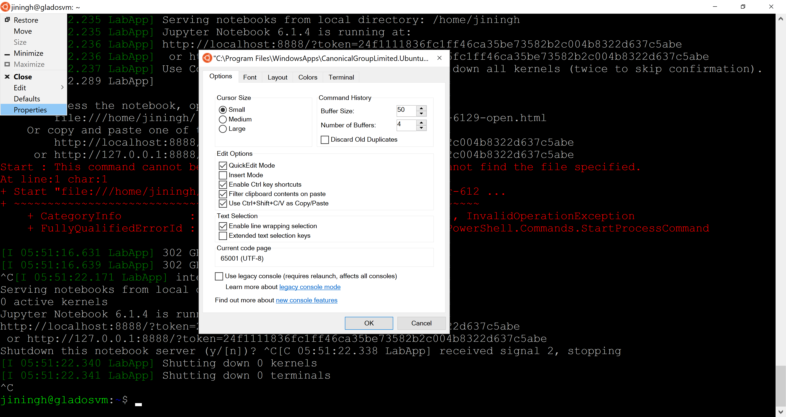

# Getting Started

## Example Jupyter notebooks

Here, we provide Jupyter notebooks for a variety of examples that can be [downloaded](https://piercelab-caltech.github.io/nupack-docs/examples.zip) for interactive use.


### Analysis examples
Analyze the equilibrium base-pairing properties one or more test tube ensembles (or one or more complex ensembles) --- these are the [all-purpose sequence analysis tools](analysis.md).

- **Tube analysis:** [analyze a test tube ensemble](https://nbviewer.jupyter.org/github/Piercelab-Caltech/nupack-docs/tree/main/examples/analysis/tube-analysis.ipynb)
- **Multi-tube analysis:** [analyze a set of test tube ensembles](https://nbviewer.jupyter.org/github/Piercelab-Caltech/nupack-docs/tree/main/examples/analysis/multi-tube-analysis.ipynb)
- **Complex analysis:** [analyze a complex ensemble](https://nbviewer.jupyter.org/github/Piercelab-Caltech/nupack-docs/tree/main/examples/analysis/complex-analysis.ipynb)
- **Multi-complex analysis:** [analyze a set of complex ensembles](https://nbviewer.jupyter.org/github/Piercelab-Caltech/nupack-docs/tree/main/examples/analysis/multi-complex-analysis.ipynb)

### Design examples
Design the the sequences for one or more test tube ensembles (or one or more complex ensembles) --- these are the [all-purpose sequence design tools](design.md).

- **Tube design:** [design a test tube ensemble](https://nbviewer.jupyter.org/github/Piercelab-Caltech/nupack-docs/tree/main/examples/design/tube-design.ipynb)
- **Multi-tube design (simple):**
    - [design specification](https://nbviewer.jupyter.org/github/Piercelab-Caltech/nupack-docs/tree/main/examples/design-specs/design-spec-displacement.pdf) ([tex](https://nbviewer.jupyter.org/github/Piercelab-Caltech/nupack-docs/tree/main/examples/design-specs/design-spec-displacement.tex))
    - [design a one-step reaction pathway](https://nbviewer.jupyter.org/github/Piercelab-Caltech/nupack-docs/tree/main/examples/design/multi-tube-design-simple.ipynb)
    - [design N orthogonal one-step reaction pathways](https://nbviewer.jupyter.org/github/Piercelab-Caltech/nupack-docs/tree/main/examples/design/multi-tube-design-simple-ortho.ipynb)
- **Multi-tube design (advanced):**
    - [design specification](https://nbviewer.jupyter.org/github/Piercelab-Caltech/nupack-docs/tree/main/examples/design-specs/design-spec-dicer.pdf) ([tex](https://nbviewer.jupyter.org/github/Piercelab-Caltech/nupack-docs/tree/main/examples/design-specs/design-spec-dicer.tex))
    - [design a multi-step reaction pathway](https://nbviewer.jupyter.org/github/Piercelab-Caltech/nupack-docs/tree/main/examples/design/multi-tube-design-advanced.ipynb)
    -  [design N orthogonal multi-step reaction pathways](https://nbviewer.jupyter.org/github/Piercelab-Caltech/nupack-docs/tree/main/examples/design/multi-tube-design-advanced-ortho.ipynb)
- **Complex design:** [design a complex ensemble](https://nbviewer.jupyter.org/github/Piercelab-Caltech/nupack-docs/tree/main/examples/design/complex-design.ipynb)

Sample $\LaTeX$ files are provided for the multi-tube design specifications to assist with making new design specs in a standardized format.


### Utilities examples
Analyze or design a single complex ensemble --- these are [quick tools](utilities.md) applicable when your ensemble is a single complex.

- **Utilities:** [analyze or design a complex ensemble](https://nbviewer.jupyter.org/github/Piercelab-Caltech/nupack-docs/tree/main/examples/utilities/utilities.ipynb)

!!! Note

    Note that each Jupyter notebook starts by loading the NUPACK Python module:

    ```python
    from nupack import *
    ```


## Installation requirements

NUPACK 4 is a C++ library distributed as a Python package. The following Python packages are required:

- Python 3.6-3.9
- numpy
- scipy
- pandas

The following packages are recommended to facilitate interactive usage:

- matplotlib
- jupyterlab

NUPACK 4 Python packages can be installed for Mac/Linux operating systems or on the Linux subsystem of Windows 10. Alternatively, NUPACK may be compiled from source on Mac/Linux.

An easy way to install all of these dependencies is by installing [Anaconda](https://www.anaconda.com/distribution/).

## Mac/Linux installation

1. Verify your Python installation (make sure you have Python 3.6 or newer):

    ```bash
    python3 --version
    ```

    If this command does not run, troubleshoot your Python installation. You may not have your `$PATH` environment variable set correctly.

2. Update your installation of `pip` and install the optional dependencies. Run the following commands

    ```bash
    python3 -m pip install -U pip
    python3 -m pip install -U matplotlib jupyterlab
    ```

    Alternatively, if you are using Anaconda, replace the above commands with:

    ```bash
    conda install --update-all pip matplotlib jupyterlab
    ```

    If this command does not run, troubleshoot your Anaconda installation. You may not have your `$PATH` environment variable set correctly.

3. After [agreeing to the NUPACK license](http://www.nupack.org/downloads/register), download the NUPACK package (e.g., `nupack-4.0.0`) into your Downloads folder and make sure it is unzipped.

4. Install the NUPACK 4 Python module by running the following command in your terminal (type `y` when prompted):

    ```bash
    python3 -m pip install -U nupack -f ~/Downloads/nupack-VERSION/package
    ```

    Make sure to replace `nupack-VERSION` with the correct folder name (e.g., `nupack-4.0.0`).

5. Check that the correct `nupack` version is now installed by running the following commmand:

    ```bash
    python3 -m pip show nupack
    ```

    If the version is not correct, go back to Step 4, double-check the folder name, and rerun the command.

6. Validate your NUPACK 4 installation by running the following commands:

    ```bash
    python3 -m pip install -U pytest
    python3 -m pytest -v --pyargs nupack
    ```

7. You can now conveniently run NUPACK 4 jobs as Jupyter notebooks (see above for [example notebooks](start.md#example-notebooks)). You can launch a web-based Jupyter notebook browser from the command line:

    ```bash
    jupyter lab
    ```

    and browse to open your notebook of choice. Click `Run->Run All Cells` to run the entire notebook. If no browser window appears, try navigating to the displayed link in your terminal. If this doesn't work, troubleshoot your Jupyter installation.

From version 4.0.0.27, the M1 Mac architecture is now natively supported by the distributed binaries. Contact <support@nupack.org> in the off chance that you are trying to run NUPACK on an unsupported architecture.

---


## Windows installation

NUPACK may be installed on Windows 10 using the Windows Subsystem for Linux 2 (WSL2).

1. Click the start menu and search for "Windows Features". Click on "Turn Windows features on or off". Check the "Windows Subsystem for Linux" icon

> 

2. Download Ubuntu from the Microsoft Store

> 

3. Open the Ubuntu app and set a username and password
> 

4. (Optional) Open the properties window and enable copy paste

> 

5. Install NUPACK as if using Linux using the following commands (type `y` when prompted):

```bash
mkdir nupack-latest
cd nupack-latest
cp /mnt/c/Users/YOUR-USERNAME/Downloads/nupack-VERSION.zip ./
sudo apt install unzip
unzip nupack-latest.zip
cd ..

wget https://repo.anaconda.com/miniconda/Miniconda3-latest-Linux-x86_64.sh
/bin/bash Miniconda3-latest-Linux-x86_64.sh -b
miniconda3/bin/conda update -n base -c defaults conda
rm Miniconda3-latest-Linux-x86_64.sh

export PATH=$HOME/miniconda3/bin:$PATH
echo 'export PATH=$HOME/miniconda3/bin:$PATH' >> ~/.bashrc

conda install numpy scipy pip matplotlib pandas jupyterlab
pip install -U nupack -f ./nupack-VERSION/package

jupyter lab
```

Make sure to replace `/YOUR-USERNAME/Downloads` above with the appropriate directory and `nupack-VERSION` with the correct version (e.g., `nupack-4.0.0`).

6. Use your web browser to open localhost:8888 and use Jupyter Lab to open an [example notebook](start.md#example-notebooks).


---

## Source installation

For Mac/Linux users, installation of binaries via `pip` is by far the easiest option and is strongly recommended. However, if necessary, NUPACK can be built from source.

The following are required:

- C++17 compliant compiler (Clang or AppleClang)
- CMake

On Mac, it is recommended to use the Clang provided by [Homebrew](https://brew.sh) as it is generally kept more up to date than Apple's builtin version. After installing Homebrew, install Clang via `brew install llvm`. Then add the flag `-DCMAKE_CXX_COMPILER=/opt/homebrew/opt/llvm/bin/clang++` or `-DCMAKE_CXX_COMPILER=/usr/local/opt/llvm/bin/clang++` to your cmake command (use the one corresponding to where `brew` installed binaries).

Directions:

1. On a Mac/Linux system, navigate to the `source` directory within the NUPACK download:

```bash
cd ~/Downloads/nupack-VERSION/source
```

Make sure to replace `nupack-VERSION` with the correct folder name (e.g., `nupack-4.0.0`).

2. Build the included `vcpkg` submodule using:

```bash
./external/vcpkg/bootstrap-vcpkg.sh
```

or if you are using a Mac and have not previously installed a C++ compiler, using the following flags:

```bash
./external/vcpkg/bootstrap-vcpkg.sh --useSystemBinaries --allowAppleClang
```

3. Next install the dependencies for NUPACK compilation using `vcpkg`:

```
./external/vcpkg/vcpkg install armadillo tbb gecode libsimdpp \
    nlohmann-json jsoncpp tclap spdlog boost-context boost-graph boost-align boost-ublas \
    boost-variant boost-thread boost-sort boost-geometry boost-odeint boost-coroutine2
```

4. Make a build directory and navigate into it:

```bash
mkdir build
cd build
```

5. Run the CMake configuration:

```bash
cmake .. -DCMAKE_BUILD_TYPE=Release
```

You may add custom compilation options as flags to the `cmake` command if desired. Some examples might be:

- Add `-DCMAKE_CXX_COMPILER=clang++` to use the `clang++` compiler. As noted above, compilers besides `clang` are not generally supported.
- Add `-DREBIND_PYTHON=/usr/local/bin/python3` to build for a specific Python executable (by default, the `python` in the user's `$PATH` is used).
- Add `-DCMAKE_CXX_FLAGS="<custom compile options>"` to add custom C++ compilation flags.

6. Build the C++ code:

```bash
cmake --build . --target nupack-python
```

7. Install the NUPACK Python module:

```bash
pip3 install .
```
